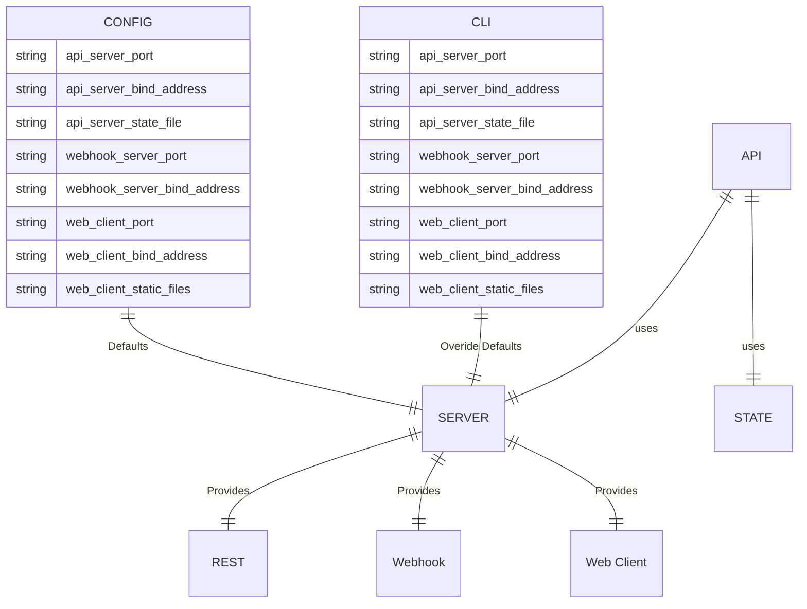

```mermaid
---
Entity Relationship
---
erDiagram
CONFIG {
	string api_server_port
	string api_server_bind_address
	string api_server_state_file
	string webhook_server_port
	string webhook_server_bind_address
	string web_client_port
	string web_client_bind_address
	string web_client_static_files
}
CLI {
	string api_server_port
	string api_server_bind_address
	string api_server_state_file
	string webhook_server_port
	string webhook_server_bind_address
	string web_client_port
	string web_client_bind_address
	string web_client_static_files
}
    SERVER ||--|| "REST" : Provides
    SERVER ||--|| "Webhook" : Provides
    SERVER ||--|| "Web Client" : Provides
    CONFIG ||--|| SERVER : "Defaults"
    CLI ||--|| SERVER : "Overide Defaults"
    API ||--|| SERVER : uses
    API ||--|| STATE : uses


```
