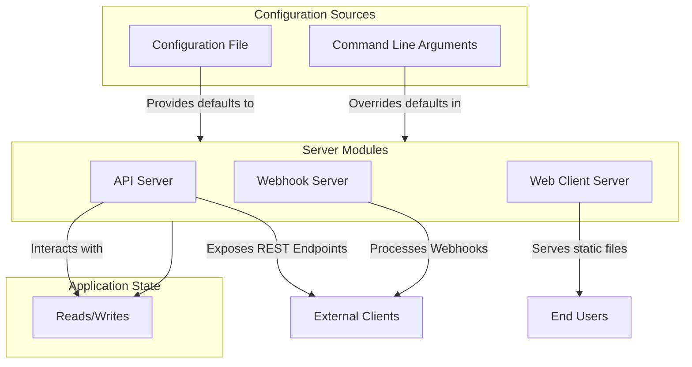

```mermaid
---
System Interaction and Relationships
---
flowchart TB
    subgraph ConfigAndCLI["Configuration Sources"]
        CONFIG[Configuration File]
        CLI[Command Line Arguments]
    end

    subgraph Server["Server Modules"]
        API[API Server]
        WEBHOOK[Webhook Server]
        WEBCLIENT[Web Client Server]
    end

    subgraph StateManagement["Application State"]
        STATE["State File (Persistent Storage)"]
    end

    CONFIG -- "Provides defaults to" --> Server
    CLI -- "Overrides defaults in" --> Server
    Server --> STATE["Reads/Writes"]
    API -- "Interacts with" --> STATE
    API -- "Exposes REST Endpoints" --> CLIENTS[External Clients]
    WEBHOOK -- "Processes Webhooks" --> CLIENTS
    WEBCLIENT -- "Serves static files" --> USERS[End Users]
```
