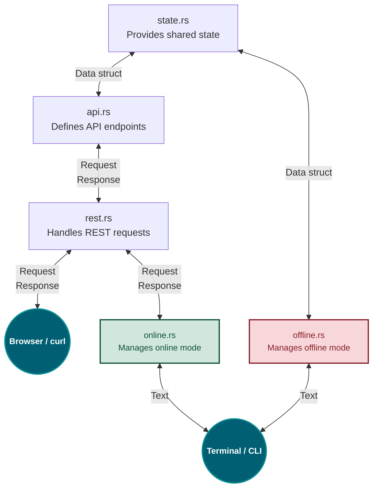

```mermaid
flowchart TD
    A[state.rs<br>Provides shared state]
    B[api.rs<br>Defines API endpoints]
    C[rest.rs<br>Handles REST requests]
    D[offline.rs<br>Manages offline mode]:::offline
    E[online.rs<br>Manages online mode]:::online
    F((Terminal / CLI)):::ui
    G((Browser / curl)):::ui

    A <-- Data struct --> B
    A <-- Data struct --> D
    B <-- Request\nResponse --> C
    C <-- Request\nResponse --> G
    C <-- Request\nResponse --> E
    E <-- Text --> F
    D <-- Text --> F

    classDef ui fill:#005f73,stroke:#0a9396,stroke-width:2px,font-size:14px,color:#ffffff,font-weight:bold;
    classDef online fill:#d1e7dd,stroke:#0f5132,stroke-width:2px,font-size:14px,color:#0f5132;
    classDef offline fill:#f8d7da,stroke:#842029,stroke-width:2px,font-size:14px,color:#842029;
```
```
Offline mode is a maintenance mode just to maintain the offline data
does not represent the actual state

Cli commands need to use online mode for the actial state
```
