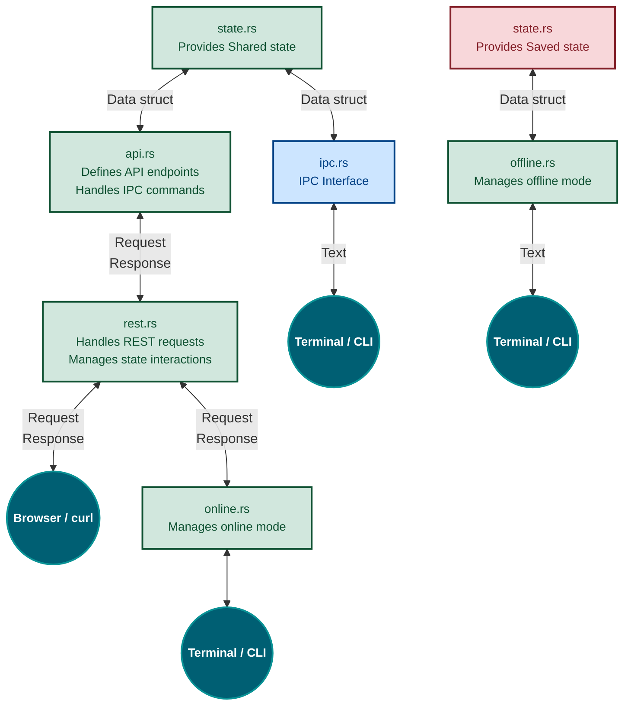

# Application Architecture Documentation
## Modules Overview

### 1. `state.rs`

- **Purpose:**  
    Serves as the centralized state management module for both online (`Shared state`) and offline (`Saved state`) operations.
    
- **Responsibilities:**
    
    - Manages shared application state (`Shared state` for online operations).
    - Manages saved application state (`Saved state` for offline operations).

---
### 2. `api.rs`

- **Purpose:**  
    Defines REST endpoints and processes requests from the Web UI or external tools (e.g., curl).
    
- **Responsibilities:**
    
    - Handles REST API requests and routes them to the appropriate logic in `rest.rs`.
    - Provides IPC command support for the CLI.

---
### 3. `rest.rs`

- **Purpose:**  
    Handles REST-based interactions for the Web UI and external clients.
    
- **Responsibilities:**
    
    - Processes REST API calls forwarded by `api.rs`.
    - Provides an interface between REST clients and the shared state.

---
### 4. `ipc.rs`

- **Purpose:**  
    Facilitates direct communication between the CLI and the shared state.
    
- **Responsibilities:**
    
    - Receives CLI commands and performs state operations directly on `state.rs`.

---

### 5. `online.rs` / `offline.rs`

- **Purpose:**  
    Handles mode-specific logic for online and offline operations.
    
- **Responsibilities:**
    
    - `online.rs`: Handles online mode operations and interactions with the REST API.
    - `offline.rs`: Handles offline mode operations and interacts directly with the saved state.

---

### 6. CLI and Web UI

- **CLI:**  
    Provides terminal-based interaction with the system via `ipc.rs`.
- **Web UI:**  
    Communicates with the REST API to perform operations on the shared state.

---

### Notes

- **Concurrency Handling:**  
    Use `RwLock` or `Mutex` in `state.rs` to manage concurrent access from REST and IPC pathways.
- **Scalability:**  
    Modularize the application into separate crates if the project grows in complexity.

