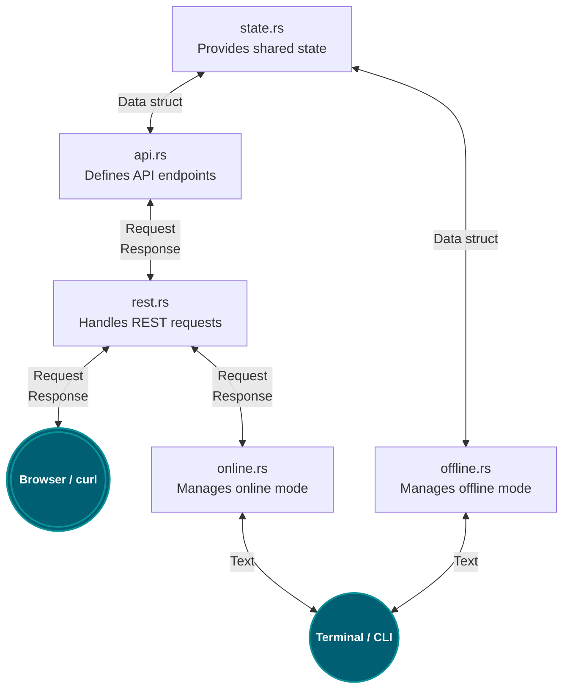

# CLI Structure





# xTrade CLI Command Table

| **Category**        | **Command**           | **Description**                                 |
|----------------------|-----------------------|-------------------------------------------------|
| **System**          | `ClearAll`           | Clears all bots or listeners.                  |
|                      | `Server`             | Runs the xTrade server with optional arguments. |
| **Bots**            | `AddBot`             | Adds a new bot.                                |
|                      | `ListBots`           | Lists all bots (with filters).                 |
|                      | `GetBot`             | Retrieves details of a specific bot.           |
|                      | `UpdateBot`          | Updates details of a specific bot.             |
|                      | `DeleteBot`          | Deletes a bot.                                 |
| **Listeners**       | `AddListener`        | Adds a listener to a bot.                      |
|                      | `ListListeners`      | Lists listeners for a specific bot (with filters). |
|                      | `GetListener`        | Retrieves details of a specific listener.      |
|                      | `UpdateListener`     | Updates details of a specific listener.        |
|                      | `DeleteListener`     | Deletes a specific listener.                   |
|                      | `DeleteListeners`    | Deletes multiple listeners with filters.       |


# State and Transport Function Flow

## Overview

This diagram shows the flow of state functions, CLI functions, REST functions, and their integration with the transport trait.

```mermaid
graph TD
    StateFunctions["State functions<br>Result<T, ApiError>"]
    APIFunctions["API functions<br>Result<(), ApiError>"]
    RESTFunctions["REST functions<br>Println<br>Result<(), ApiError>"]
    CLIFunctions["CLI functions<br>Println<br>Result<(), ApiError>"]
    TransportTrait["Transport Trait<br>Println<br>Result<(), ApiError>"]

    StateFunctions --> APIFunctions
    StateFunctions --> CLIFunctions
    APIFunctions --> RESTFunctions
    RESTFunctions --> TransportTrait
    CLIFunctions --> TransportTrait


Key Concepts
	1.	State Functions
	•	These operate on the in-memory state and return Result<T, ApiError>.
	•	Examples include database-like operations or local state manipulation.
	2.	API Functions
	•	These functions wrap the state functions but abstract them into application programming interfaces.
	•	They typically return Result<(), ApiError>.
	3.	CLI Functions
	•	These operate in offline mode.
	•	They call state functions, print results to the console, and return Result<(), ApiError>.
	4.	REST Functions
	•	These make HTTP requests to remote APIs, print results, and return Result<(), ApiError>.
	5.	Transport Trait
	•	Unifies CLI and REST functions under a single interface.
	•	Defines common methods like add_bot, list_listeners, and others, ensuring consistency across implementations.
