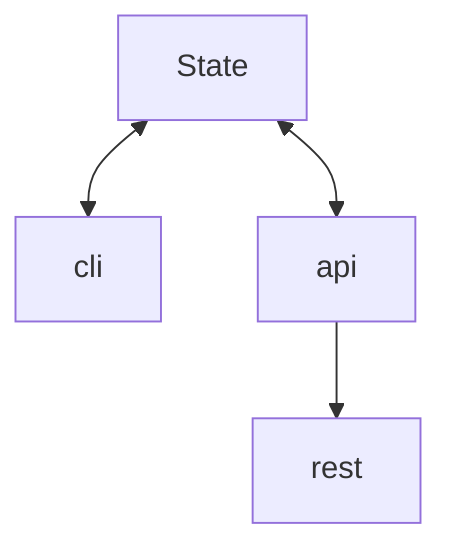

This module aims to manage the application state
It Exports the main data structures
	- Bot
	- Listener
It exports the main Application State
and provides CRUD operations to update the state
currently is a list os bots each with attached listeners

| Task               | Function   | Input validation | Output Struct |
| ------------------ | ---------- | ---------------- | ------------- |
| add a bot          | add_bot    | BotInsertArgs    | BotView       |
| List Bots          | list_bot   | BotListArgs      | BotViewList   |
| Fetch a Bot by ID  | get_bot    | bot_id           | BotViewList   |
| Update a Bot by ID | update_bot | bot_id           | BotViewList   |
| Delete a Bot by ID | delete_bot | bot_id           | BotViewList   |

